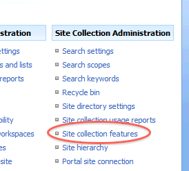
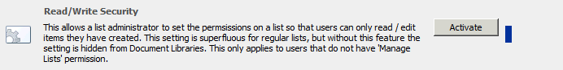
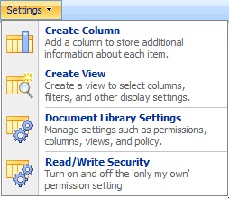
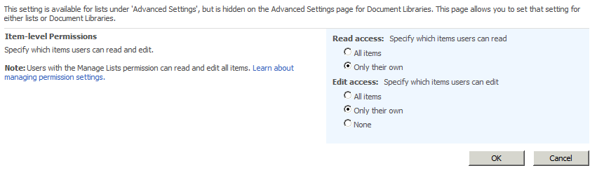

# Sharepoint-2010-Features

This is a collection of Sharepoint 2010 Tools by Tim Larson. So far I have one feature - adding the 'only your own' permission setting to Document Libraries.

Read/Write Security

Download: [Read/Write Security Version 0.2](https://github.com/codethug/Sharepoint-2010-Features/releases/download/0.2/ReadWriteSecurity.wsp)

## Only their own

By default, only lists that are not document libraries have the ability to set the 'Only their own' permission. This permission allows users to edit / read only documents that they have created, and not documents that others have created. (Users with 'Manage Lists' permissions on the site can read all items, regardless of who created them). This feature allows an admin to turn this setting on for a Document Library.

Caveat: As with the 'Only their own' permission on Lists, setting the 'Only their own' permission on a document library does not provide true permissions. If a user is allowed to use web services, explorer view, and other ways of getting to the list data, they can get around the 'Only their own' permission setting. The 'Only their own' setting will only be effective when working with list data in the context of a list view.

To use this, 
1. Install the ReadWriteSecurity.wsp solution file by running this command on your Sharepoint server:

`stsadm -o addsolution -filename ReadWriteSecurity.wsp`

2. Deploy the solution to your web application by running this command on your sharepoint server:

`stsadm -o deploysolution -name ReadWriteSecurity.wsp -url https://www.companywebsite.com -local -allowGacDeployment`

3. Activate the feature on the site collection. To do this, navigate to the site where you want to use it. Click 'Site Actions' - 'Site Settings' - 'Modify All Site Settings.' Look under 'Site Collection Administration.' If it says 'Go to top level site settings', click on that link. Then click on 'Site Collection Features' under 'Site Collection Administration'.

You should see 'Read/Write Security' listed as a feature. Click the 'Activate' button.

4. Open the list by going to 'Site Settings' - 'View all Site Content' and clicking on the list name. If you are an admin on the site, you will see a 'Read/Write Security' option under the 'Settings' drop down. Click on this.

5. Now you should see the 'Only their own' permission for the document library. 

Note that on a standard list (e.g., non-document library), this settings panel is redundant to the setting in the 'Advanced Settings' link for the list.
